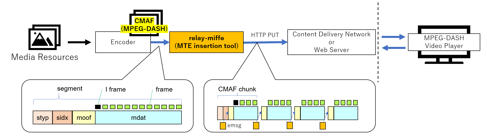
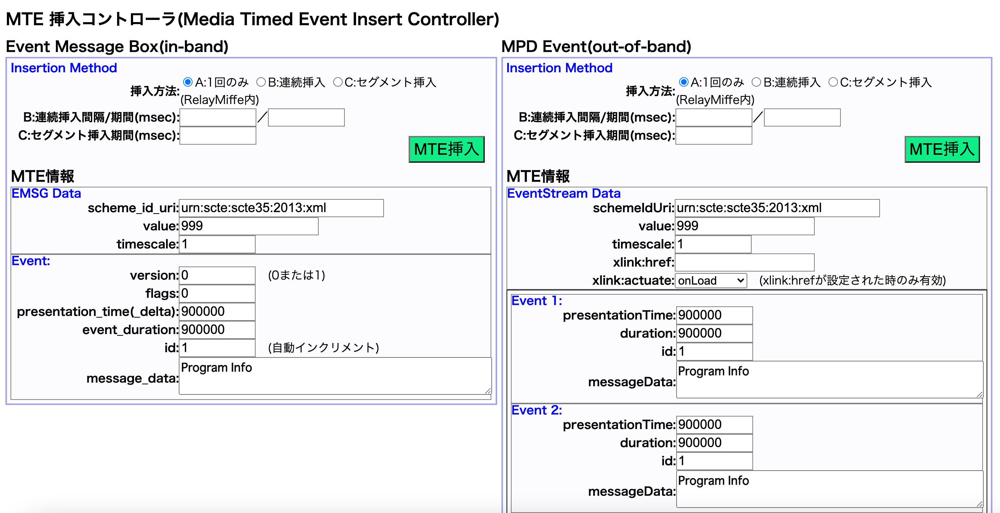

# relay-miffe

Media Timed Events(MTE) inserter  
(miffe = Media timed events format data Inserter For Fmp4 as Emsg box)  
[Japanese Document](./README_JP.md)

## Overview

- Insert Media Timed Events(MTE : Reference[3]) into MPEG-DASH.

- Support for in-band and out-of-band MTE
    - For in-band, event metadata (emsg box) can be inserted for each MPEG-DASH segment (mp4) and for each CMAF chunk for ultra low latency.
    - For out-of-band, event metadata can be inserted in the manifest file (mpd).
    - Media Timed Events can be controlled via WebAPI.

- INPUT/OUTPUT of the inserter supports HTTP PUT 
    - low delay.
    




- Reference
    - [1] ISO/IEC23000-19：“Common media application format (CMAF) for segmented media”
    - [2] ISO/IEC23009-1：“Dynamic adaptive streaming over HTTP (DASH)Part 1: Media presentation description and segment formats”
    - [3] [W3C Media Timed Events](https://www.w3.org/TR/media-timed-events/)

## Environment

- python 3.7.x ~ 3.10.x

## Interoperability

This tool has been tested for interoperability with the following OSS and environments.

- Encoder
    - [ffmpeg](https://www.ffmpeg.org/)
    - Videon EdgeCaster

- Video Playback Player
    - [dash.js](https://github.com/Dash-Industry-Forum/dash.js)
    - [hls.js](https://github.com/video-dev/hls.js/)
    - [basjoo.js](https://github.com/nhkrd/relay-miffe)

- Video Distribution Environment
    - [delivery-miffe](https://github.com/nhkrd/delivery-miffe)
    - Akamai(CDN)
    - AWS(CDN)

## Directory

```
.
├── LICENSE.txt
├── README.md
├── NOTICE.txt
├── docs
├── index.html      # menu page
├── input.log       # log file
├── relay.sh        # start shell
├── relaymiffe.py
├── settings.ini    # setting
├── test
│   ├── postemsg    # Sample for in-band (emsg box) insertion
│   └── postmpd     # Sample for out-of-banf (mpd) insertion
└── tools           # sample page for insertion
```

## How to Use

### startup

- run tools
```
$ ./relay.sh
($ python3 relaymiffe.py)
```

IP address and port can be set in [settings.ini].

### Encoder output settings (input to relay-miffe) 

Set URL of relay-miffe as output destination of encoder. And enter web server in the URL query.

```
# Configuration example
http://[IP address and port number of relay-miffe]/?url=http://[IP address of web server]/[directory]
```

For a sample using ffmpeg [click here](./test/ffmpeg_sample.sh).

### Insert　MTE

Insert an event using the sample page for insertion or API.

#### in-band event

As an in-band event, an emsg box can be inserted into the mp4.
For a in-band sample, [click here](./test/postemsg.sh).

```
$ curl -X POST -H "Content-Type: application/json" -d '[Event parameters in JSON format]' http://xxx.xxx.xxx.xxx:8500/mte
```

The following parameters can be set.[in-band insertion sample](./test/postemsg_sample.json)

```
{
    "scheme_id_uri" : "urn:scte:scte35:2013:xml",
    "value" : "999",
    "timescale" : 1,
    "version" :	0 (0 or 1),
    "flags" : 0,
    "presentation_time_delta" : 900000,
    "event_duration" : 900000,
    "id" : 1 (Auto increment),
    "message_data" : "sample"
}
```

#### out-of-band event

As an out-of-band event, event tags can be inserted into mpd.
For a out-of-band sample, [click here](./test/postmpd.sh).

```
$ curl -X POST -H "Content-Type: application/json" -d '[Event parameters in JSON format]' http://xxx.xxx.xxx.xxx:8500/mte
```

The following parameters can be set.[out-of-band insertion sample](./test/postmpd_sample.json)

```
{
    "xlink:href" : ,
    "xlink:actuate" : "onLoad(Only valid if href is set)",
    "schemeIdUri" :	"urn:scte:scte35:2013:xml",
    "value" : "999",
    "timescale" : 1,
}
{
    "presentationTime" : 900000,
    "duration" : 900000,
    "id" : 1,
    "messageData" : "sample"
}
```

### Web Console for Event Insertion

Events can also be inserted using the Insert Web Console.

#### page
- menu page
```
http://[IP address and port of relay-miffe]/index.html
```

- sample page for insertion
```
http://[IP address and port of relay-miffe]/tools/html/mteinserter.html
```



## Ohters

### API for checking startup status

The activation status of this tool can be checked via HTTP GET.

```
# Check in Browser
http://[IP address and port of relay-miffe]/status
```

### output log

For mp4 received via HTTP from the encoder, analyze the data box structure(moof,styp) and output the location as a log file(input.log).
If there is an API control to insert an emsg, the timing of when the control was received (received) and the timing of when the event was inserted (insert) are also logged and output.

```
# Example of log output
1641534603168,http://localhost:8000/content/ffmpeg7/chunk-stream0-00026.m4s START
~~~
1641534603232,http://localhost:8000/content/ffmpeg/chunk-stream1-00026.m4s,b'moof',449,100
1641534603470,emsg received 1
1641534603782,http://localhost:8000/content/ffmpeg/chunk-stream0-00026.m4s,b'moof',8106,100
1641534603782,http://localhost:8000/content/ffmpeg/chunk-stream1-00026.m4s,b'moof',447,100
1641534603782,emsg insert before http://localhost:8000/content/ffmpeg/chunk-stream0-00026.m4s,b'moof'
~~~
1641534607902,http://localhost:8000/content/ffmpeg7/chunk-stream1-00026.m4s END
```

## License

See [LICENSE.txt](./LICENSE.txt) and [NOTICE.txt](./NOTICE.txt).
