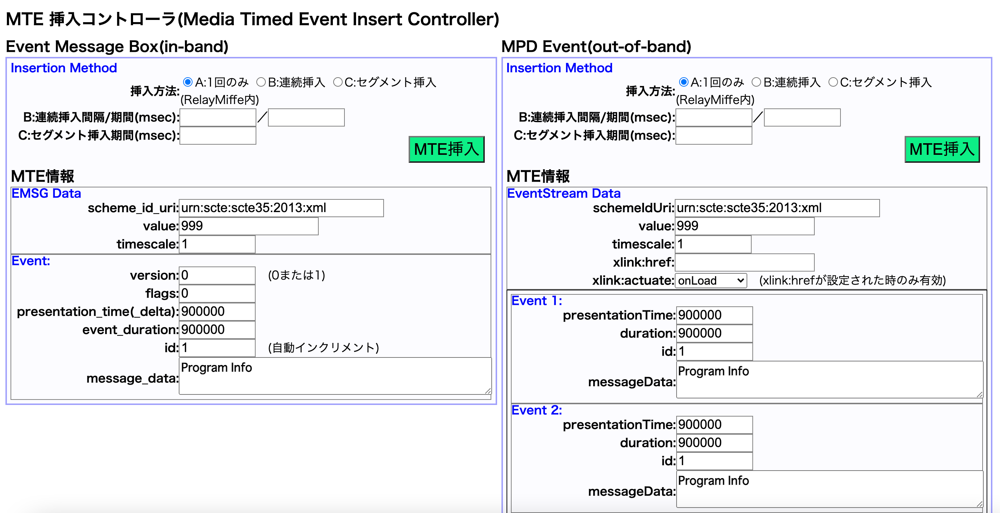

# relay-miffe

Media Timed Events(MTE)の挿入ツール  
(miffeは「Media timed events format data Inserter For Fmp4 as Emsg box」の略)  
[English Document](./README.md)

## 概要

- 本ソフトウェアは、CMAF（Common Media Application Format : Reference[1]）および、MPEG-DASH（Dynamic Adaptive Streaming over HTTP : Reference[2]）の動画配信コンテナフォーマットに対し、Media Timed Events（Reference[3]）のイベント用メタデータを挿入するツールです。

- エンコーダーなどから出力されたCMAFおよびMPEG-DASHのHTTPストリーミング配信を受信して、Media Timed Eventsを挿入し、動画配信サーバーに渡すことができます。
    - これらの一連の処理は遅延なく行うことができます。
    - HTTPのChunked Transfer Encodingの入出力にも対応しており、CMAF-ULL（Ultra-Low Latency）の低遅延配信を行いながらMedia Timed Eventsを挿入できます。

- Media Timed Eventsとしては、in-band及びout-of-bandに対応しています。
    - in-bandについては、MPEG-DASHのsegment（mp4）単位と、CMAFのchunkの単位で、それぞれイベント用メタデータ（emsg box）を挿入できます。
    - out-of-bandについては、マニフェストファイル（mpd）にイベント用メタデータを挿入できます。
    - Media Timed EventsのEventはWebAPIで挿入制御できます。


- Reference
    - [1] ISO/IEC23000-19：“Common media application format (CMAF) for segmented media”
    - [2] ISO/IEC23009-1：“Dynamic adaptive streaming over HTTP (DASH)Part 1: Media presentation description and segment formats”
    - [3] [W3C Media Timed Events](https://www.w3.org/TR/media-timed-events/)

## 実行環境

- python 3.7.x ~ 3.10.x

## 相互接続性

本ツール(relay-miffe)は、下記OSSおよび環境との相互接続性を確認しています。

- エンコーダー
    - [ffmpeg](https://www.ffmpeg.org/)
    - Videon EdgeCaster

- 動画再生プレイヤー
    - [dash.js](https://github.com/Dash-Industry-Forum/dash.js)
    - [hls.js](https://github.com/video-dev/hls.js/)
    - [basjoo.js](https://github.com/nhkrd/relay-miffe)

- 動画配信環境
    - [delivery-miffe](https://github.com/nhkrd/delivery-miffe)
    - Akamai(CDN)
    - AWS(CDN)

## フォルダ構成

```
.
├── LICENSE.txt
├── README.md
├── NOTICE.txt
├── docs
├── index.html      # メニューページ
├── input.log       # ログファイル
├── relay.sh        # 実行用sh
├── relaymiffe.py
├── settings.ini    # 設定ファイル
├── test
│   ├── postemsg    # EMSGの挿入API確認用
│   └── postmpd     # mpdの挿入API確認用
└── tools           # ブラウザからeventをinsertするためのWebUI
```

## 使い方

### サーバー起動

- 起動
```
$ ./relay.sh
($ python3 relaymiffe.py)
```

relay-miffeのIPアドレスとポートは[settings.ini]で設定できます。

### エンコーダーの出力設定(relay-miffeへの入力)

エンコーダーの出力設定としてHTTPを選択し、出力先にはrelay-miffeのURL、およびURLクエリに配信サーバーのURLを入力します。

```
# 設定例
http://[relay-miffeのIPアドレスとポート]/?url=http://[配信サーバーのIPアドレス]/[directory]
```

ffmpegの場合のサンプルは[こちら](./test/ffmpeg_sample.sh)。

### Media Timed Eventsの挿入

Media Timed EventsのEventは、WebAPIで挿入制御できます。  

#### in-bandのイベント

in-bandのイベントとして、mp4にemsg boxを挿入できます。  
in-bandのAPI実行例は[こちら](./test/postemsg.sh)です。

```
$ curl -X POST -H "Content-Type: application/json" -d '[Event parameters in JSON format]' http://xxx.xxx.xxx.xxx:8500/mte
```

下記のパラメータが設定可能です。（[挿入時のサンプルjson](./test/postemsg_sample.json)）

```
{
    "scheme_id_uri" : "urn:scte:scte35:2013:xml",
    "value" : "999",
    "timescale" : 1,
    "version" :	0 (0または1),
    "flags" : 0,
    "presentation_time_delta" : 900000,
    "event_duration" : 900000,
    "id" : 1 (自動インクリメント),
    "message_data" : "sample"
}
```

#### out-of-bandのイベント

out-of-bandのイベントとして、mpdにイベントtagを挿入できます。  
out-of-bandのAPI実行例は[こちら](./test/postmpd.sh)です。

```
$ curl -X POST -H "Content-Type: application/json" -d '[Event parameters in JSON format]' http://xxx.xxx.xxx.xxx:8500/mte
```

下記のパラメータが設定可能です。（[挿入時のサンプルjson](./test/postmpd_sample.json)）

```
{
    "xlink:href" : ,
    "xlink:actuate" : "onLoad(xlink:hrefが設定された時のみ有効)",
    "schemeIdUri" :	"urn:scte:scte35:2013:xml",
    "value" : "999",
    "timescale" : 1,
}
{
    "presentationTime" : 900000,
    "duration" : 900000,
    "id" : 1,
    "messageData" : "sample"
}
```

### イベント挿入用Webコンソール

挿入用のWebコンソールを用いてイベントを挿入することもできます。

#### ページ
- メニューページ
```
http://[relay-miffeのIPアドレスとポート]/index.html
```

- イベント挿入用Webコンソール
```
http://[relay-miffeのIPアドレスとポート]/tools/html/mteinserter.html
```



## その他

### 起動確認用API

relay-miffeの起動状態をHTTP GETで確認できます。

```
# ブラウザで確認する場合
http://[relay-miffeのIPアドレス]:[relay-miffeのポート番号]/status
```

### ログ出力(input.log)

エンコーダーからHTTPで受信したmp4について、データのbox構造(moof,styp)を解析し場所をログ(input.log)ファイルとして出力します。  
また、APIによるemsgの挿入制御があった場合は、制御を受信したタイミング(received)と、イベントを挿入したタイミング(insert)もログ出力します。

```
# ログ出力例
1641534603168,http://localhost:8000/content/ffmpeg7/chunk-stream0-00026.m4s START
~~~
1641534603232,http://localhost:8000/content/ffmpeg/chunk-stream1-00026.m4s,b'moof',449,100
1641534603470,emsg received 1
1641534603782,http://localhost:8000/content/ffmpeg/chunk-stream0-00026.m4s,b'moof',8106,100
1641534603782,http://localhost:8000/content/ffmpeg/chunk-stream1-00026.m4s,b'moof',447,100
1641534603782,emsg insert before http://localhost:8000/content/ffmpeg/chunk-stream0-00026.m4s,b'moof'
~~~
1641534607902,http://localhost:8000/content/ffmpeg7/chunk-stream1-00026.m4s END
```

## ライセンス

本ソフトウェアのライセンスについては[LICENSE.txt](./LICENSE.txt)および[NOTICE.txt](./NOTICE.txt)を参照ください。
